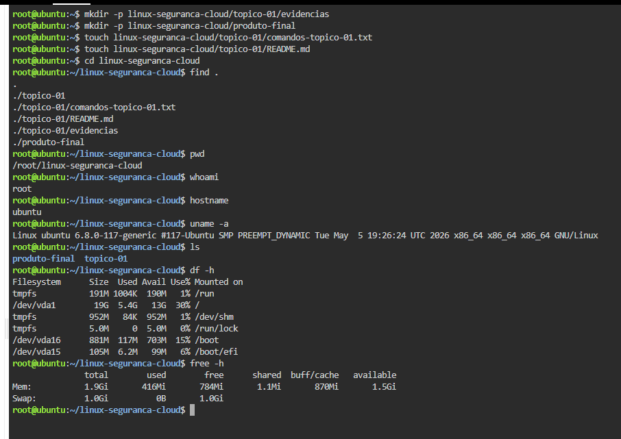

# linux-seguranca-cloud

## Skodji Digital — Módulo 3
### Linux, Segurança e Cloud

**Formanda:** Andreia Semedo

Repositório criado para organizar atividades práticas, evidências técnicas, comandos Linux e documentação do módulo de Linux, Segurança e Cloud.

---

# Tópico 1 - Preparação do ambiente Linux

## Ambiente utilizado
Linux no browser através da plataforma Killercoda.

## Objetivo desta atividade
Preparar o ambiente Linux e organizar a primeira evidência técnica.

---

## Estrutura criada

```txt
linux-seguranca-cloud/
├── topico-01/
│   ├── evidencias/
│   ├── comandos-topico-01.txt
│   └── README.md
└── produto-final/
```

---

## Comandos executados

### pwd
Mostra o diretório atual.

### whoami
Mostra o utilizador autenticado.

### hostname
Mostra o nome da máquina.

### uname -a
Mostra informações do sistema Linux e kernel.

### df -h
Mostra espaço disponível em disco.

### free -h
Mostra utilização da memória RAM.

### ls
Lista ficheiros e diretórios.

---

## Diferença entre VM, VPS e infraestrutura em nuvem

### VM Local
Máquina virtual executada no computador do utilizador usando software de virtualização.

### VPS
Servidor virtual privado alojado num datacenter e acessível remotamente.

### Infraestrutura em nuvem
Ambiente escalável fornecido por plataformas cloud como AWS, Azure ou Google Cloud.

---

## Dificuldades encontradas
Foram encontradas pequenas dificuldades na criação inicial do ambiente Linux no browser, mas o acesso ao terminal foi concluído com sucesso.

---

## Próximos passos
Preparar o ambiente para configuração de utilizadores, permissões, serviços e segurança Linux.

---

## Registo da atividade

### Trilho seguido
Trilho B - Linux no browser

### Ambiente utilizado
Killercoda

### Estado do ambiente
Ambiente funcional com acesso ao terminal Linux.

### Dificuldade encontrada
Pequena dificuldade inicial no acesso à plataforma.

### Plano para continuar
Continuar a utilizar Linux no browser nas próximas atividades até configurar uma VM local.

---

# Produto Final

Esta pasta será utilizada para armazenar o projeto final desenvolvido ao longo do módulo.

---

## Evidências

### Screenshot do terminal Linux

