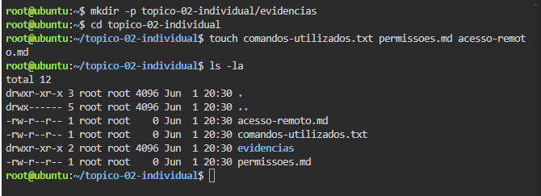
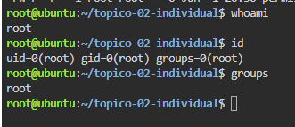
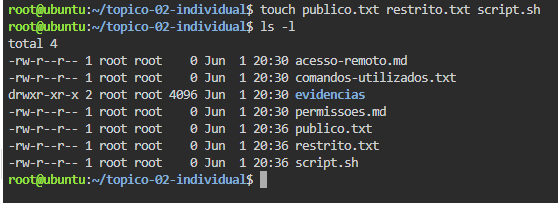
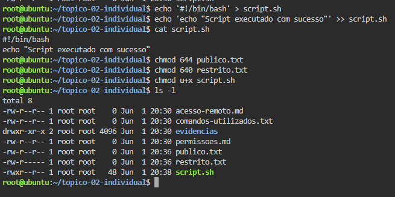
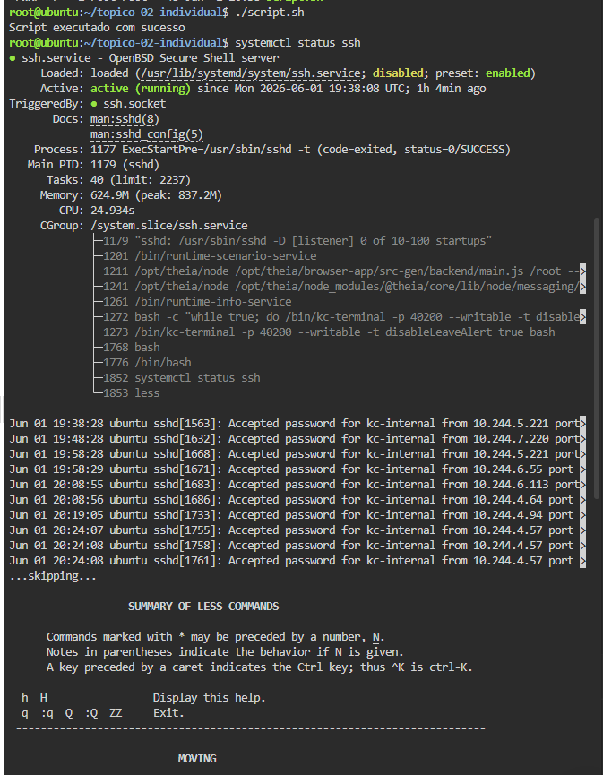

# Atividade Prática Individual - Tópico 2

## Gestão de Utilizadores, Grupos, Permissões e Acesso Remoto

### Formanda
**Andreia Semedo**

### Ambiente Utilizado
Linux no Browser (Killercoda)

---

## Objetivo da Atividade

Aplicar conceitos de:

- Gestão de utilizadores e grupos;
- Permissões de ficheiros e diretórios;
- Princípio do menor privilégio;
- Acesso remoto seguro utilizando SSH.

---

## Estrutura do Projeto

```text
topico-02-individual/
├── comandos-utilizados.txt
├── permissoes.md
├── acesso-remoto.md
└── evidencias/
    ├── evidencia-01-estrutura.PNG
    ├── evidencia-02-utilizador-grupos.PNG
    ├── evidencia-03-ficheiros.PNG
    ├── evidencia-04-permissoes.PNG
    └── evidencia-05-script.PNG
```

---

## Comandos Utilizados

### Identificação do Utilizador

```bash
whoami
id
groups
```

### Criação de Ficheiros

```bash
touch publico.txt
touch restrito.txt
touch script.sh
```

### Aplicação de Permissões

```bash
chmod 644 publico.txt
chmod 640 restrito.txt
chmod u+x script.sh
```

### Execução do Script

```bash
./script.sh
```

---

## Evidências

### Evidência 1 – Estrutura Criada



---

### Evidência 2 – Utilizador e Grupos



---

### Evidência 3 – Ficheiros Criados



---

### Evidência 4 – Permissões Aplicadas



---

### Evidência 5 – Execução do Script



---

## Princípio do Menor Privilégio

Foram atribuídas apenas as permissões necessárias para cada ficheiro:

| Ficheiro | Permissão | Descrição |
|-----------|-----------|------------|
| publico.txt | 644 | Leitura para todos e escrita apenas para o proprietário |
| restrito.txt | 640 | Acesso limitado ao proprietário e grupo |
| script.sh | Executável pelo proprietário | Permite execução controlada do script |

Esta abordagem reduz riscos de acesso indevido e contribui para uma melhor segurança do sistema.

---

## Acesso Remoto por SSH

O protocolo SSH (Secure Shell) permite realizar acesso remoto seguro a servidores Linux através de comunicação cifrada.

### Exemplo de utilização

```bash
ssh utilizador@endereco_ip
```

### Vantagens do SSH

- Comunicação segura e encriptada;
- Administração remota de servidores;
- Transferência segura de ficheiros;
- Autenticação por palavra-passe ou chave pública.

---

## Dificuldades Encontradas

Durante a realização da atividade surgiram algumas dificuldades iniciais relacionadas com:

- Utilização de comandos Linux;
- Interpretação das permissões de ficheiros;
- Aplicação correta dos comandos `chmod`.

Estas dificuldades foram ultrapassadas através da prática e experimentação dos comandos.

---

## Conclusão

Esta atividade permitiu consolidar conhecimentos fundamentais sobre:

- Gestão de utilizadores e grupos;
- Controlo de permissões;
- Segurança baseada no princípio do menor privilégio;
- Acesso remoto seguro através do protocolo SSH.

Os conceitos aprendidos são essenciais para a administração e segurança de sistemas Linux.