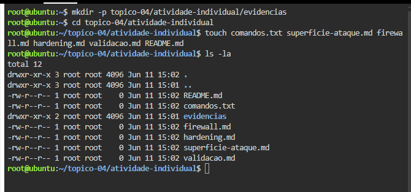
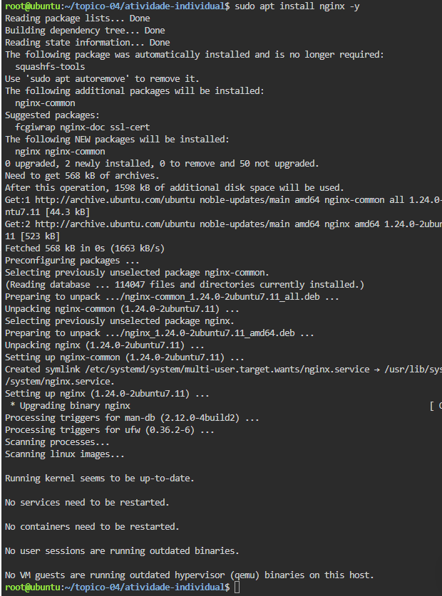
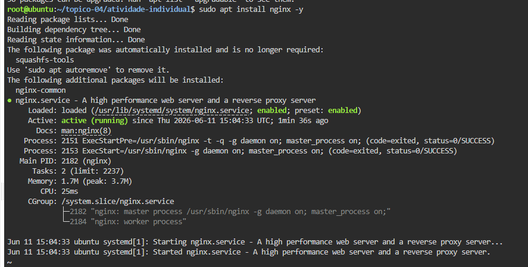
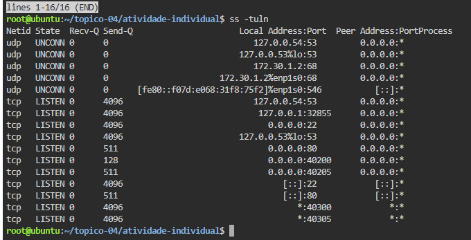
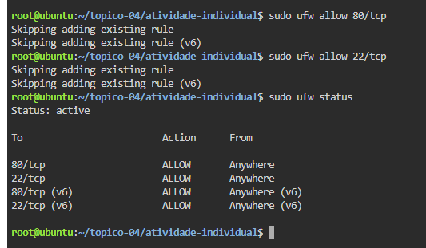
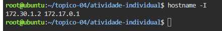
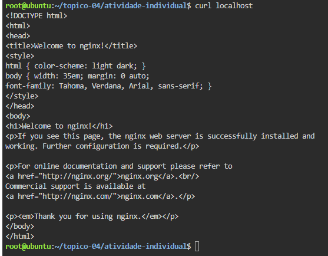

# Atividade Prática Individual - Tópico 4

## Segurança Inicial do Serviço Web

### Formanda

Andreia Semedo

### Ambiente utilizado

Linux no browser (Killercoda)

### Serviço utilizado

Nginx

### Nível realizado

Nível 3 - Avançado

### Objetivo

Identificar a superfície de ataque do serviço web, analisar riscos e propor medidas iniciais de hardening.

### Ficheiros da atividade

- comandos.txt
- superficie-ataque.md
- firewall.md
- hardening.md
- validacao.md

## Evidências

### Estrutura da atividade

### Serviço Ngin

### Portas identificadas

### Firewall

### Endereço IP

### Validação do serviço

### Evidências recolhidas

- Serviço Nginx ativo
- Portas identificadas
- Estado da firewall analisado
- Endereço IP identificado
- Validação do serviço realizada

### Conclusão

Foram analisados os principais riscos do serviço web e propostas medidas iniciais de segurança para reduzir a superfície de ataque do servidor.