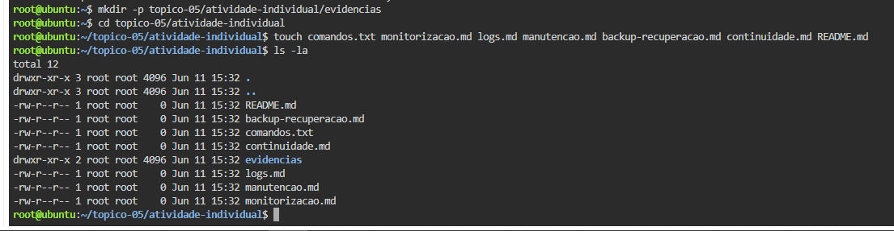
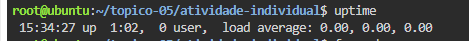
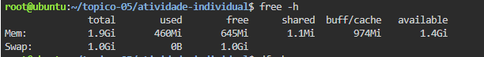
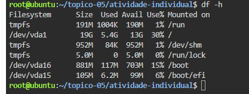
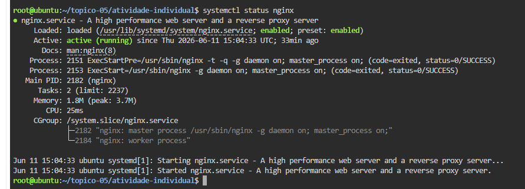
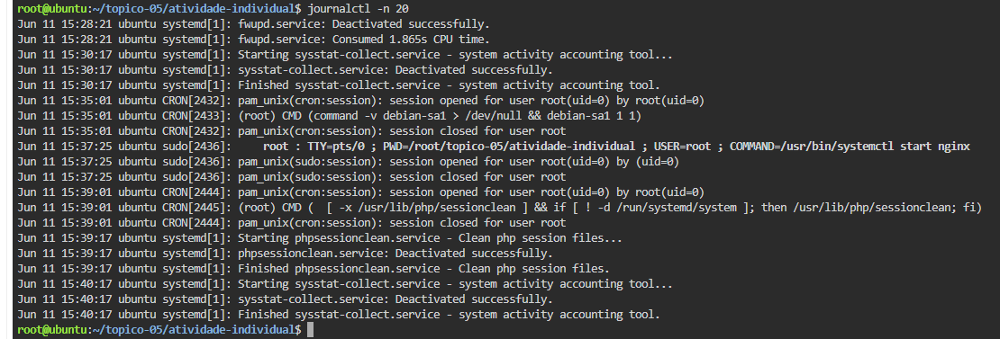
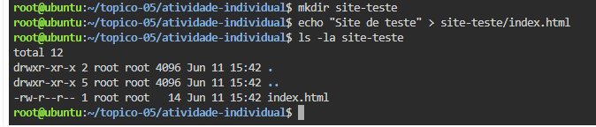
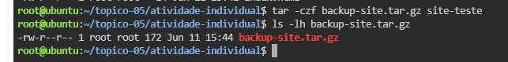
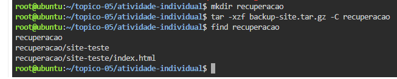

# Atividade Prática Individual - Tópico 5

## Formanda

Andreia Semedo

## Ambiente utilizado

Linux no browser (Killercoda)

## Nível realizado

Nível 3 - Avançado

## Objetivo

Monitorizar recursos do sistema, consultar logs, criar backups, testar recuperação e definir um plano de continuidade operacional.

## Ficheiros produzidos

- monitorizacao.md
- logs.md
- manutencao.md
- backup-recuperacao.md
- continuidade.md

## Evidências

### Estrutura criada

### Tempo de atividade

### Memória

### Espaço em disco

### Serviço Nginx

### Logs

### Diretório de teste

### Backup

### Recuperação

## Conclusão

Foi possível monitorizar o sistema, analisar logs, criar um backup e validar a recuperação dos ficheiros.